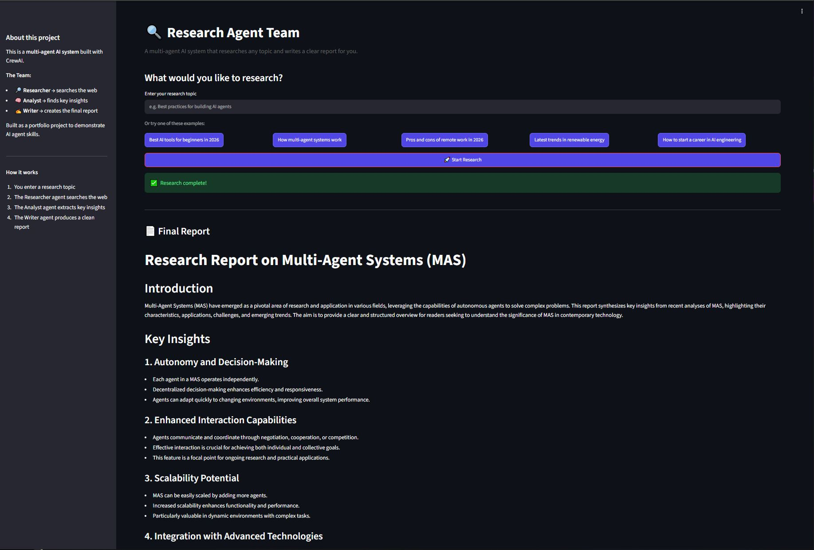
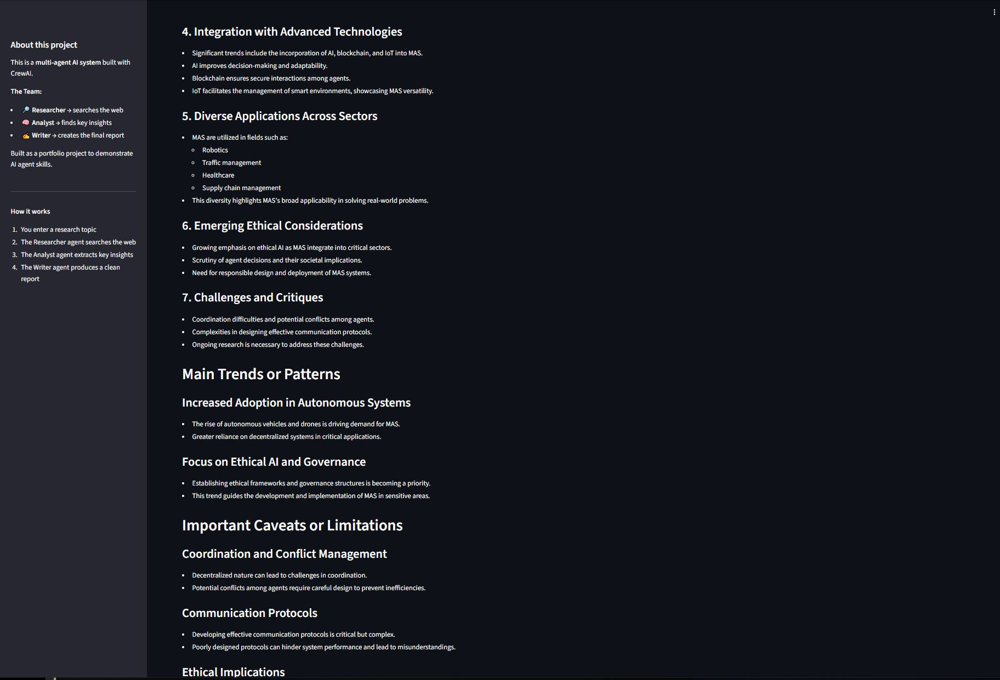
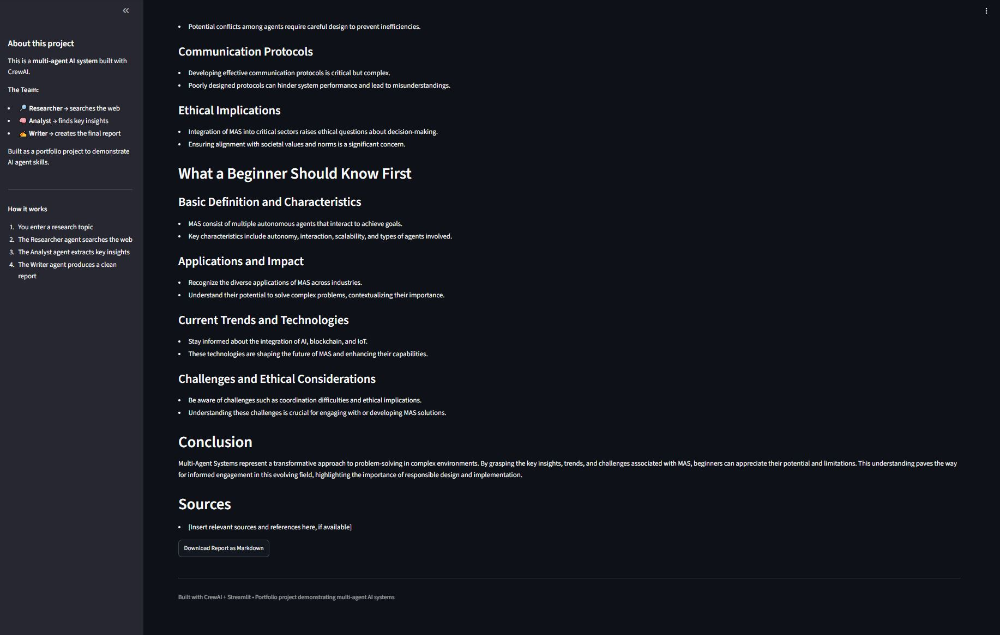

# 🔍 Research Agent Team


**A multi-agent AI system that researches any topic and writes a clear, structured report.**

Built as a portfolio project to demonstrate practical AI agent skills.

🚀 **[Click Here to Test the Live Application](https://research-agent-team-git-981831266697.us-central1.run.app)**

### 🛠️ Tech Stack & Infrastructure
* **Framework:** CrewAI, Python
* **Frontend:** Streamlit
* **Deployment:** Google Cloud Run, Docker
* **Tools:** Web Search API


## What This Project Does

You give it a research question → a team of 3 AI agents work together → you get a well-written report.

| Agent | Role | What it does |
|-------|------|--------------|
| 🔎 **Researcher** | Senior Research Specialist | Searches the web for relevant, up-to-date information |
| 🧠 **Analyst** | Critical Analyst | Extracts key insights, trends, and important takeaways |
| ✍️ **Writer** | Professional Report Writer | Turns the analysis into a clean, readable report |

This architecture demonstrates production-grade multi-agent orchestration, managing state, tool use, and context passing across specialized AI roles.


## 💼 Why This Project Matters (for recruiters / hiring managers)

* **Sequential Context Passing:** Demonstrates orchestrating state and data flow between specialized models without hallucination or context drop.
* **Production Architecture:** Modularized codebase separating agent configurations, custom tools, and execution logic for easy scaling.


## 🛑 Challenges Overcome & Engineering Insights

### 1. Handling Serverless Cold Starts on Cloud Run
* **Challenge:** Streamlit sessions timed out when the Cloud Run container booted up from zero instances.
* **Solution:** Optimized the Docker build layers and pinned requirements to reduce container size and startup latency.

### 2. Context Passing Between CrewAI Agents
* **Challenge:** The Writer agent occasionally generated reports missing critical facts extracted by the Analyst.
* **Solution:** Refined task memory structures and structured task outputs in YAML config files to ensure strict schema adherence across agent handoffs.

## ⚡ Quickstart & Live Demo
 
🚀 **[Click Here to Test the Live Application](https://research-agent-team-git-981831266697.us-central1.run.app)** 🚀

If you prefer running the app locally on your machine:
```bash
# After setup (see below)
streamlit run app.py
```

Or from the terminal:

```bash
python main.py "Best AI tools for beginners in 2026"
```

---

## Project Structure

```
research-agent-team/
├── app.py                  # Streamlit web interface (recommended way to try it)
├── main.py                 # Simple command-line version
├── requirements.txt
├── .env.example
├── src/
│   ├── crews/
│   │   └── research_crew.py    # The main multi-agent logic
│   ├── tools/
│   │   └── search_tools.py     # Web search tools
│   └── config/
│       ├── agents.yaml         # Agent role definitions
│       └── tasks.yaml          # Task definitions
├── examples/
└── docs/
```

---

## Setup Instructions (Beginner Friendly)

### 1. Prerequisites

- Python 3.10 or higher
- An OpenAI API key ([get one here](https://platform.openai.com/api-keys))

### 2. Clone the repository

```bash

git clone [https://github.com/AgenticSystemsLab/research-agent-team.git](https://github.com/AgenticSystemsLab/research-agent-team.git)
cd research-agent-team
```

### 3. Create a virtual environment (recommended)

```bash
python -m venv venv

# On Mac/Linux:
source venv/bin/activate

# On Windows:
venv\Scripts\activate
```

### 4. Install dependencies

```bash
pip install -r requirements.txt
```

### 5. Add your API key

```bash
cp .env.example .env
```

Open the `.env` file and paste your OpenAI API key:

```
OPENAI_API_KEY=sk-your-real-key-here
```

(Optional) For better search results, also add a free Tavily key from [tavily.com](https://tavily.com):

```
TAVILY_API_KEY=tvly-your-key-here
```

### 6. Run the project

**Option A – Web interface (easiest):**
```bash
streamlit run app.py
```

**Option B – Terminal:**
```bash
python main.py "Your research topic here"
```

---

## 🔄 How the Agents Work Together

```
User Topic
    ↓
[Researcher]  →  searches the web using tools
    ↓
[Analyst]     →  reads the findings and extracts insights
    ↓
[Writer]      →  produces the final structured report
    ↓
Final Report
```

This sequential execution pipeline is orchestrated using CrewAI. Each specialized agent utilizes:

* **Role & Specific Goal:** High-precision task execution avoiding single-prompt drift.

* **Tailored Backstory:** Contextual grounding for consistent tone and domain behavior.

* **Scoped Tool Access:** Least-privilege design (only the Researcher has external search access).

This architecture demonstrates production-grade multi-agent orchestration, managing state, tool use, and context passing across specialized AI roles.


## 📸 Example Output & Interface Preview
When you run a research query (e.g., "Best practices for building AI agents"), the crew executes a sequential pipeline to deliver:

* **Structured Overview:** Executive title, context, and clear introduction

* **Core Analysis:** Categorized key insights and emerging trends

* **Actionable Takeaways:** Practical recommendations and concluding summary

| 1. Submit Query & Top Results | 2. Key Insights & Analysis | 3. Complete Agent Report |
| :---: | :---: | :---: |
|  |  |  |


## 🛠️ Technologies Used
* **CrewAI** – Multi-agent orchestration framework

* **OpenAI (gpt-4o-mini)** – High-speed LLM logic engine

* **DuckDuckGo Search** – Native web search integration (no API key required)

* **Tavily** – Advanced research search API (optional)

* **Streamlit** – Interactive frontend interface

* **Python** – Core runtime

## 💡 Engineering Takeaways
* **Role Specialization:** Designed modular, single-responsibility agent roles rather than relying on one general-purpose prompt.

* **Context Preservation:** Standardized intermediate payloads to maintain schema integrity across task handoffs.

* **Tool Scoping:** Enforced principle of least privilege by restricting Web Search API access solely to the research agent.

* **Cost & Performance Optimization:** Balanced speed and API expenditure by leveraging gpt-4o-mini with strict context caps.

* **User-Centric Interface:** Wrapped technical pipeline in a clean Streamlit UI for non-technical evaluation.


## 🔮 Future Work & Roadmap
- [x] Implement persistent vector memory for historical context retrieval

- [x] Add native document/PDF parsing capabilities for custom corpus research

- [x] Implement multi-branch parallel agent execution for sub-topic exploration

- [x] Integrate automated evaluation frameworks (e.g., Ragas / DeepEval)

- [x] Add rate limiting and session isolation for serverless deployments

- [x] Establish automated CI/CD pipeline via GitHub Actions for Google Cloud Run


## 📜 License
Distributed under the MIT License. See LICENSE for details.

---

Thank you for taking the time to review this project! If you have any questions or feedback, feel free to reach out or open an issue.
